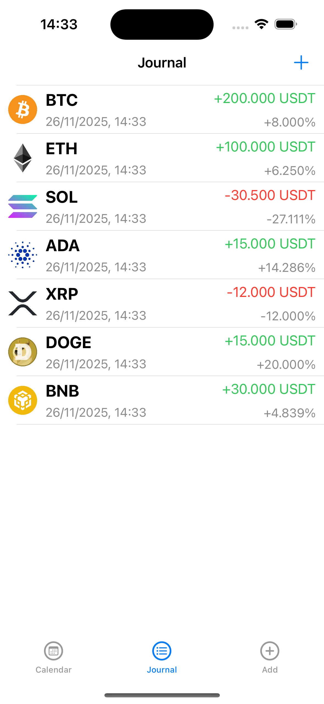
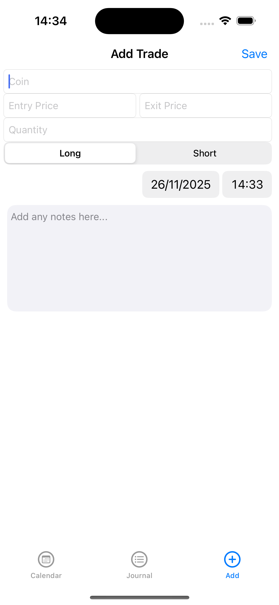
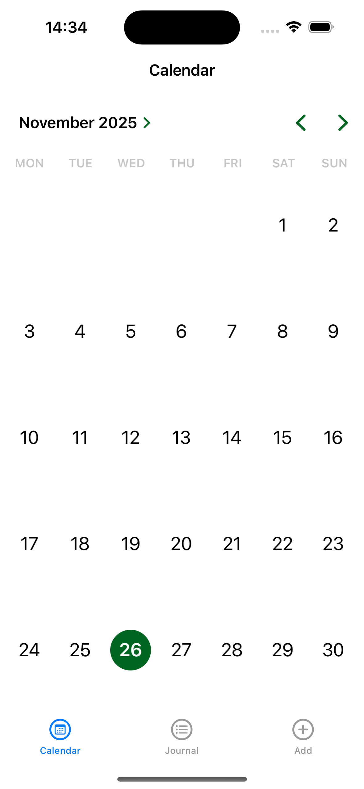

# iOS Trading Journal

An iOS trading journal app designed to help traders log, track, and analyze their trades in a structured and intuitive way.

## Features

- **Trade Logging**: Record trade details including:
  - Coin/asset
  - Entry price
  - Exit price
  - Trade type (Long/Short)
  - Quantity
  - Date
  - Personal notes

- **Automatic Calculations**: Profit/loss and percentage change are calculated automatically for each trade.

- **Trade Review**: 
  - Clean table view listing all trades
  - Dedicated detail screen for reviewing individual trades

- **Easy Entry**: Simple form for adding new trades along with personal notes to capture insights for future reference.

- **Minimal Design**: Built using UIKit and Storyboards with a focus on clean, intuitive user experience.

## Screenshots

  

    
Journal

    
  

  

    
Notes

    
  

  

    
Calendar

    
  

